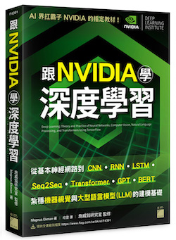

## DL-basic

### 簡介
本專案介紹深度學習 (Deep Learning) 的基礎原理與重點技術。包含以下方向：

- 人工智慧 (AI) 的歷史發展
- 神經網路 (Neuron Network) 的基本概念，包含神經元、梯度下降、反向傳播、模型訓練與優化等
- 電腦視覺 (Computer Vision) 的重點技術，包含 CNN、YOLO、GAN 等模型
- 自然語言處理 (Natural Language Processing) 的重點技術，包含 RNN、LSTM、seq2seq 等模型
- 大型模型 (Large Language Model) 的重點技術，包含 Transformer、GPT、Diffusion 等模型

文章內容請參考以下章節：

1. [DL 首部曲: to Know (神經網路)](https://ryanccj.github.io/blog/2025/deep-learning-basic-I)
2. [DL 二部曲: to See (電腦視覺)](https://ryanccj.github.io/blog/2025/deep-learning-basic-II) (待更新)
3. [DL 三部曲: to Speak (自然語言)](https://ryanccj.github.io/blog/2025/deep-learning-basic-III) (待更新)
4. [DL 四部曲: to Think (大型模型)](https://ryanccj.github.io/blog/2025/deep-learning-basic-IV) (待更新)

### 參考書目
本教學系列文主要參考 [NVIDIA 官方推薦的書目](https://www.nvidia.com/zh-tw/training/books/)「Learning Deep Learning: Theory and Practice of Neural Networks, Computer Vision, Natural Language Processing, and Transformers Using TensorFlow」，或是可以去各大實體或網路通路選購中譯版「跟 NVIDIA 學深度學習」。

